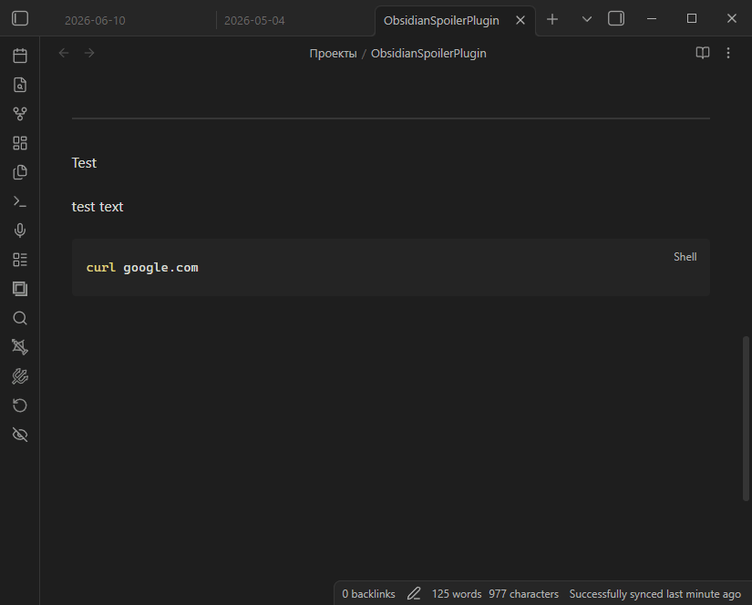

# Obsidian Spoiler Plugin

An [Obsidian](https://obsidian.md) plugin that lets you hide and reveal sensitive
text in your notes with a single click. Select some text, press the ribbon
button, and the selection is wrapped in a collapsible **spoiler** callout. Press
it again on a spoiler and it gets unwrapped back to plain text.



## Features

- Adds a button to the left ribbon (near *Open daily note*).
- Wraps the currently selected text in a collapsible spoiler callout.
- Toggling: if the selection already is a spoiler, it is unwrapped back to plain
  text.

## Spoiler format

The plugin wraps your selection in a collapsible `spoiler` callout. Each line of
the selection becomes a callout line, so any markdown inside it (headings, lists,
code blocks, …) is preserved:

```markdown
> [!spoiler]-
> super_secret_key
```

In reading view this renders as a collapsed callout; click it to reveal the
hidden contents. The `-` after `[!spoiler]` is what makes the callout start
collapsed.

Unwrapping is the exact inverse — it removes the callout markers and returns
your original text untouched, so wrapping and then unwrapping a selection always
gives back exactly what you started with.

## Usage

1. Open a note and select the text you want to hide.
2. Click the spoiler button in the left ribbon.
3. The selected text is replaced with a spoiler callout.
4. To reveal it permanently, select the spoiler and click the button again to
   unwrap it.

## Installation

### From a release (recommended)

1. Download `obsidian-spoiler-plugin_v0.2.1.zip` from the
   [latest release](https://github.com/PatruusBarba/ObsidianSpoilerPlugin/releases/latest).
2. Unzip it into your vault's plugins folder so you end up with
   `<vault>/.obsidian/plugins/obsidian-spoiler-plugin/` containing `main.js` and
   `manifest.json`.
3. Reload Obsidian and enable **Spoiler** in *Settings → Community plugins*
   (you may need to turn off *Restricted mode* first).

### Building from source

```bash
npm install
npm run build
```

This produces `main.js`. Copy it together with `manifest.json` into
`<vault>/.obsidian/plugins/obsidian-spoiler-plugin/`, then reload Obsidian and
enable the plugin as above.

## License

MIT
